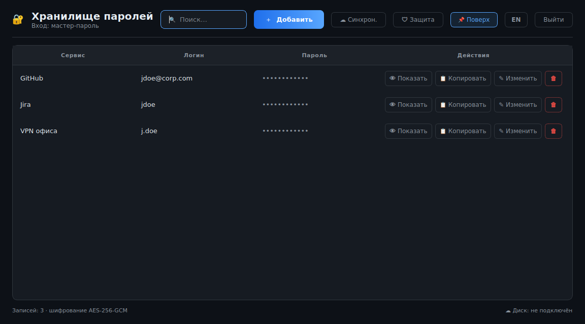
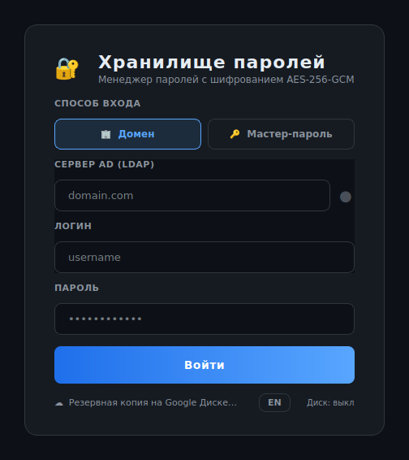

# 🔐 ZaPassKa

Менеджер паролей для Windows и Linux. Пароли хранятся на вашем компьютере в
зашифрованном виде, а резервная копия по желанию уезжает в ваш Google Диск,
чтобы те же записи были доступны на другом компьютере.



## Что умеет

- Хранит пароли, логины и названия сервисов в зашифрованном виде
- Открывается либо доменной учётной записью, либо мастер-паролем, на выбор
- Генерирует надёжные пароли
- Копирует пароль в буфер и сам очищает его через полминуты
- Синхронизирует записи между компьютерами через ваш Google Диск
- Ищет по названию сервиса и логину
- Интерфейс на русском и английском

## Установка

Скачайте готовый файл со страницы
[Releases](https://github.com/0siriss/ZaPassKa/releases).

- **Windows**: запустите `ZaPassKa.exe`. При первом запуске SmartScreen
  покажет предупреждение, потому что файл не подписан: нажмите «Подробнее» и
  «Выполнить в любом случае».
- **Linux**: разрешите запуск командой `chmod +x ZaPassKa` и запустите файл.
  Чтобы приложение появилось в меню, выполните `packaging/install-linux.sh`.

## Как пользоваться



**Первый вход.** Выберите способ входа. Если в компании есть домен, укажите
адрес сервера, логин и доменный пароль. Если домена нет, нажмите «Создать
хранилище с мастер-паролем».

**Записи.** Кнопка «Добавить» создаёт новую запись. Пароль можно придумать
самому или сгенерировать кнопкой рядом с полем. «Показать» открывает пароль в
таблице, «Копировать» кладёт его в буфер обмена.

**Смена способа входа.** Раздел «Защита» переключает хранилище с домена на
мастер-пароль и обратно. Записи при этом никуда не деваются. Действующий
способ всегда один.

**Смена мастер-пароля.** Там же, кнопка «Сменить мастер-пароль». Приложение
спросит текущий пароль, чтобы чужой человек не мог переставить его на
незапертом компьютере.

**Google Диск.** Подключить аккаунт можно двумя способами: кнопкой
«Резервная копия на Google Диске» в окне входа или кнопкой «Подключить Диск»
прямо в хранилище. Откроется браузер, где вы войдёте в свой Google. После
этого копия обновляется сама при каждом изменении, а кнопка превращается в
«Синхрон.» для ручного запуска.

На втором компьютере подключите тот же аккаунт, нажмите «Скачать хранилища» и
войдите привычным способом.

## Обновление со старой версии

Если на компьютере уже лежит база от прежней версии, ничего делать не нужно.
Войдите так же, как входили раньше, доменным логином и паролем. Приложение
само перенесёт записи в новый формат при первом входе и покажет их в списке.
Старые данные при этом не копируются вслепую: переносится только то, что
открывается вашим паролем, поэтому несколько человек на одной машине
переезжают независимо друг от друга.

Если пароль не подойдёт, приложение прямо скажет об этом и оставит старую
базу нетронутой, чтобы можно было попробовать ещё раз. Пустое хранилище
поверх старого оно не создаст.

На втором компьютере порядок другой: сначала подключите Google Диск и нажмите
«Скачать хранилища», и только потом входите. Иначе получится два отдельных
хранилища с одинаковыми записями.

## Важно знать

- Мастер-пароль нигде не хранится. Если его забыть, записи не восстановит
  никто, включая нас.
- То же касается доменного пароля: при его смене приложение один раз спросит
  предыдущий, и этот момент лучше не пропускать.
- В Google Диск попадают только зашифрованные данные, в скрытую служебную
  папку, доступную одному этому приложению.

## Где лежат данные

| Система | Папка |
|---|---|
| Windows | `%APPDATA%\ZaPassKa` |
| Linux | `~/.zapasska` |

## Сборка из исходников

```bash
pip install -r requirements.txt
python main.py
```

Готовые файлы для обеих систем собираются автоматически в GitHub Actions.
Подробности об устройстве приложения собраны в
[docs/ARCHITECTURE.md](docs/ARCHITECTURE.md).

## Документы

[Политика конфиденциальности](https://0siriss.github.io/ZaPassKa/privacy.html) ·
[Условия использования](https://0siriss.github.io/ZaPassKa/terms.html)
